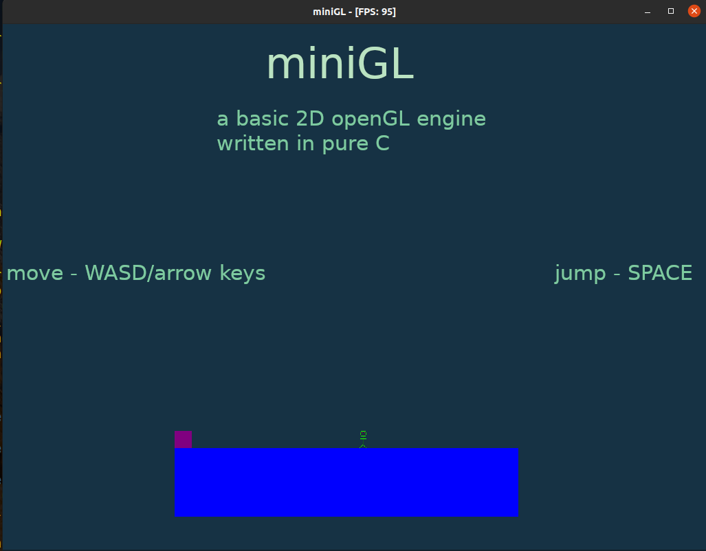

# miniGL

A small and simple 2D OpenGL engine in C using: 
- GLFW - multi platform OpenGL
- GLEW - OpenGL extensions
- Nuklear - menus
- OpenAL - audio 
- stb_image.h - image loading

This engine handles rendering, texturing, batch rendering, audio, input, for openGL is a simple package. A simple example game is setup by default in the repo. It is entirely contained to main.c

# how to build:

## linux

## windows

# todo
- particle system
- animations
- fix memory leak
